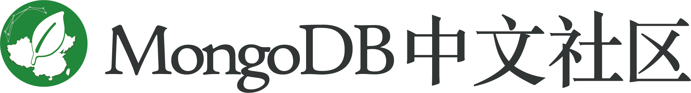

#  [MongoDB中文手册|官方文档中文版](https://man.mongoing.com/)

##  项目介绍 

MongoDB是专为可扩展性，高性能和高可用性而设计的数据库。它可以从单服务器部署扩展到大型、复杂的多数据中心架构。利用内存计算的优势，MongoDB能够提供高性能的数据读写操作。 MongoDB的本地复制和自动故障转移功能使您的应用程序具有企业级的可靠性和操作灵活性。  

本项目为MongoDB官方文档的中文版，与[官方文档](https://docs.mongodb.com/manual/)保持同步。  

维护地址  
[Github](https://github.com/SoloJu/MongoDB_CN_Manual)  
[在线阅读](https://man.mongoing.com/)  

## 报告问题  
在我们的Github [MongoDB-Manual-zh/issues](https://github.com/SoloJu/MongoDB_CN_Manual/issues)上提 issue.    

## 贡献指南  
请您勇敢地去翻译和改进翻译。虽然我们追求卓越，但我们并不要求您做到十全十美，因此请不要担心因为翻译上犯错——在大部分情况下，我们的服务器已经记录所有的翻译，因此您不必担心会因为您的失误遭到无法挽回的破坏。（改编自维基百科）  

[如何提交请点击](https://github.com/SoloJu/MongoDB_CN_Manual/blob/master/CONTRIBUTING.md)

## 贡献者名单

[文档翻译贡献者名单](https://github.com/SoloJu/MongoDB_CN_Manual/blob/master/List-of-contributors.md) 
点击[文档翻译认领列表](https://github.com/SoloJu/MongoDB_CN_Manual/blob/master/Document-translation-claim-list.md)参与翻译。

## 其他
欢迎任何人参与和完善：一个人可以走的很快，但是一群人却可以走的更远。  
予人成功才是最大的成功 。

## 免责声明

MongoDB中文社区  纯粹出于学习目的与个人兴趣翻译，不追求任何经济利益。

本译文只供学习研究参考之用，不得用于商业用途。我方将保留对此版本译文的署名权及其它相关权利。

## [LICENSE](https://github.com/SoloJu/MongoDB_CN_Manual/blob/master/LICENSE)
